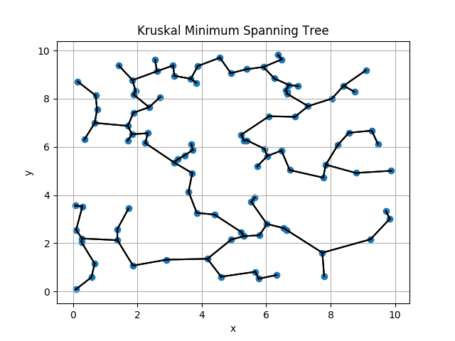
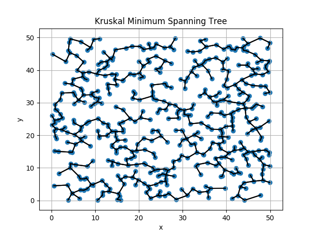

# Kruskal Minimum Spanning Tree

Language: Python 2.7

Implements [Kruksal's algorithm](https://en.wikipedia.org/wiki/Kruskal%27s_algorithm) for a minimum spanning tree. It doesn't aim to be super efficient and you'll find two notes in the comments for ways to speed it up. That being said, though, those two optimizations aren't nearly enough. There is a lot more to do, should someone want to optimize it. Past that it provide you several options which you can see with:

```
./main.py -h
```

requires matplotlib for graphing result

## Results:

100 Nodes



500 Nodes

