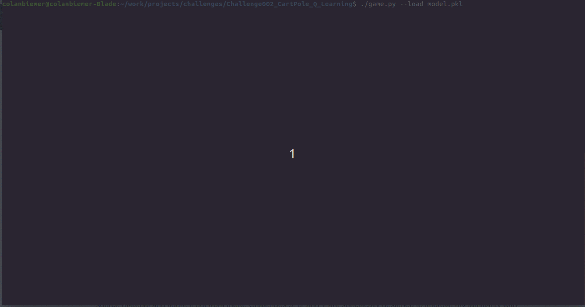

I'm currently learning keras and this kind of reinforcment learning so the implementatin for this challenge and the following one will be highly derivative of [keon's implementation](https://github.com/keon/deep-q-learning/blob/master/dqn.py). I really am just trying to learn the basic structure of this type of program and why it is done this way. In the future I hope to rely less on these outside sources and just go straight to the source material and figure it out from there. Chalenges 5, 6, and 7 are specifically designed to improve my familiarity with Keras to meet this goal. Following the completion of the before mentioned challenges, I'll add new challenges which further work with Keras and hopefully take me back to the openai gym to look into more interesting environments such as [Doom](https://gym.openai.com/envs/#doom).

To run simple use `./game -h` to be given instructions on how to provide arguments to get the results you are interested in. I've also include models pickle file `models.pkl` that you can choose to load and see the best result with. 

To see the pushed model in action use:

```bash
./game --load model.pkl

```

### Results

 
