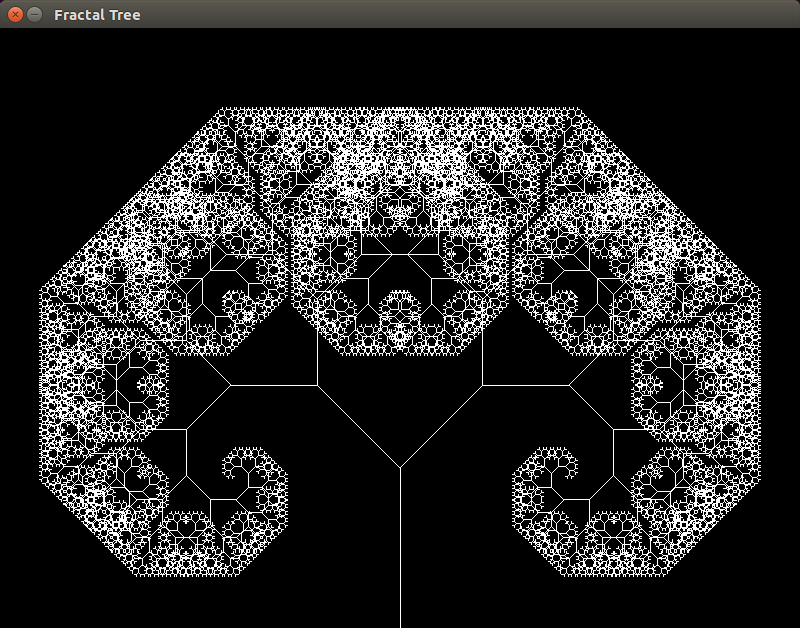
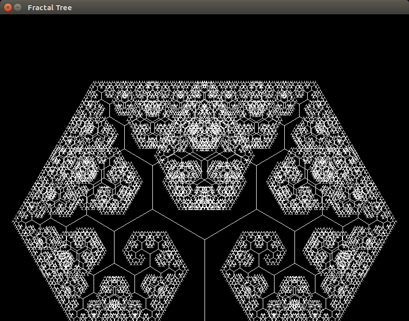

I recently came across a [youtube video](https://www.youtube.com/watch?v=0jjeOYMjmDU) where I guy implemented a fractal tree visualization with [P5.js](https://p5js.org/) and I decided it would be a good place to take a look at rendering something similar with pygame. Besides providing credit, I really don't have much to add because it was all very simple to create. If I wanted to add more to the project I would probably expose the configuration to the user via the GUI. In addition, it would be necessary to clean up the line length at that point to not be negative. Both changes are simple, just not necessary or interesting. 

### Pictures

